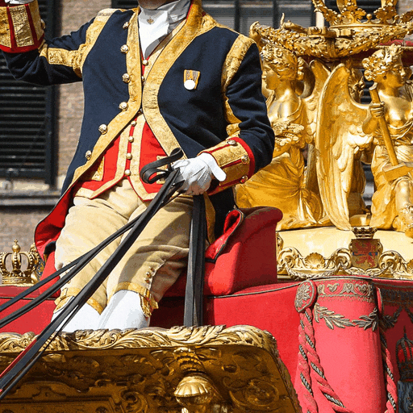

# Learning to Generate Realistic Noisy Images via Pixel-level Noise-aware Adversarial Training (NeurIPS 2021)
[](https://noise.visinf.tu-darmstadt.de/benchmark/#results_srgb)
[](https://proceedings.neurips.cc/paper/2021/file/1a5b1e4daae265b790965a275b53ae50-Paper.pdf)
[](https://proceedings.neurips.cc/paper/2021/file/1a5b1e4daae265b790965a275b53ae50-Supplemental.pdf)

#### News
- **2022.04.17 :** Testing codes, pre-trained models, and results have been released. :rocket: 
- **2021.09.30 :** Our paper has been accepted by NeurIPS 2021. 🔥

|                       Gaussian Noise                          |                        PNGAN Noise                        |
| :-----------------------------------------------------------: | :-------------------------------------------------------: |
|  |  |


<hr />

> **Abstract:** *Existing deep learning real denoising methods require a large amount of noisy-clean image pairs for supervision. Nonetheless, capturing a  real noisy-clean dataset is an unacceptable expensive and cumbersome procedure. To alleviate this problem, this work investigates how to generate realistic noisy images. Firstly, we formulate a simple yet reasonable noise model that treats each real noisy pixel as a random variable. This model splits the noisy image generation problem into two sub-problems: image domain alignment and noise domain alignment. Subsequently, we propose a novel framework, namely Pixel-level Noise-aware Generative Adversarial Network (PNGAN). PNGAN employs a pre-trained real denoiser to map the fake and real noisy images into a nearly noise-free solution space to perform image domain alignment. Simultaneously, PNGAN establishes a pixel-level adversarial training to conduct noise domain alignment. Additionally, for better noise fitting, we present an efficient architecture Simple Multi-scale Network (SMNet) as the generator. Qualitative validation shows that noise generated by PNGAN is highly similar to real noise in terms of intensity and distribution. Quantitative experiments demonstrate that a series of denoisers trained with the generated noisy images achieve state-of-the-art (SOTA) results on four real denoising benchmarks.* 
<hr />

## PNGAN Framework
 

## Main Results
The quantitative results of models finetuned with the image pairs generated by our PNGAN are listed in the following table. Our models achieve state-of-the-art results.
 


## Create Environment
The model is built in PyTorch 1.1.0 and tested on Ubuntu 16.04 environment (Python3.7, CUDA9.0, cuDNN7.5).

For installing, follow these intructions

```shell
sudo apt-get install cmake build-essential libjpeg-dev libpng-dev
conda create -n pytorch1 python=3.7
conda activate pytorch1
conda install pytorch=1.1 torchvision=0.3 cudatoolkit=9.0 -c pytorch
pip install matplotlib scikit-image opencv-python yacs joblib natsort h5py tqdm
```

Or you can directly install

```shell
conda env create -f PNGAN.yaml
```

## Noise Removal
Download our pre-trained models ([Google Drive](https://drive.google.com/drive/folders/1ykkqUB7jA0flsoWWC1Um8YBjy5_OnZqN?usp=sharing) | [Baidu Disk](https://pan.baidu.com/s/108K8VAPVEULaRMo-ZCxbNQ), code: 65m5) and place them into folder 'pre-trained'
following these instructions

```shell
# For SIDD denoising
python test_denoiser.py --method mirnet --input_dir ./datasets/SIDD/ --result_dir ./results/SIDD/noise_removal/ --weights ./pre-trained/MIRNet_sidd.pth

# For PolyU denoising
python test_denoiser.py --method mirnet --input_dir ./datasets/PolyU/ --result_dir ./results/PolyU/noise_removal/ --weights ./pre-trained/MIRNet_polyu.pth

# For Nam denoising
python test_denoiser.py --method ridnet --input_dir ./datasets/Nam/ --result_dir ./results/Nam/noise_removal/ --weights ./pre-trained/RIDNet_nam.pth
```

For DND denoising, we provide the denoised results on [DND](https://noise.visinf.tu-darmstadt.de/) in folder `./results/DND/noise_removal/`. The file is named in terms of 'id_PSNR_SSIM.png'. Our method ranks the 4th place on the public [leaderboard](https://noise.visinf.tu-darmstadt.de/benchmark/#results_srgb). We have also provided denoised results on SIDD, PolyU, and Nam.

for instance, on PolyU

the denoised results are in `./results/PolyU/noise_removal/`


## Noise Generation
We provide the noisy images generated by PNGAN on SIDD, DND, PolyU, Nam, DF2K, Urban100, Kodak24, BSD68 and Gaussian noisy images (X50) for other works to compare their performance with PNGAN.

for instance, on SIDD

the generated noisy images are in `./results/SIDD/noise_modeling/`

the Gaussian noisy images are in `./results/SIDD/Gaussian_noise/`

If you want to compare Gaussian noisy images at other level (*e.g.,* X30, X70), run the matlab script:

```shell
run('Generate_TrainData_HQ_LQ_Denoising_RGB.m')
```


# Citation
```
@inproceedings{cai2021learning, 
title={Learning to Generate Realistic Noisy Images via Pixel-level Noise-aware Adversarial Training}, 
author={Cai, Yuanhao and Hu, Xiaowan and Wang, Haoqian and Zhang, Yulun and Pfister, Hanspeter and Wei, Donglai}, 
booktitle={Thirty-Fifth Conference on Neural Information Processing Systems}, 
year={2021}}
```
